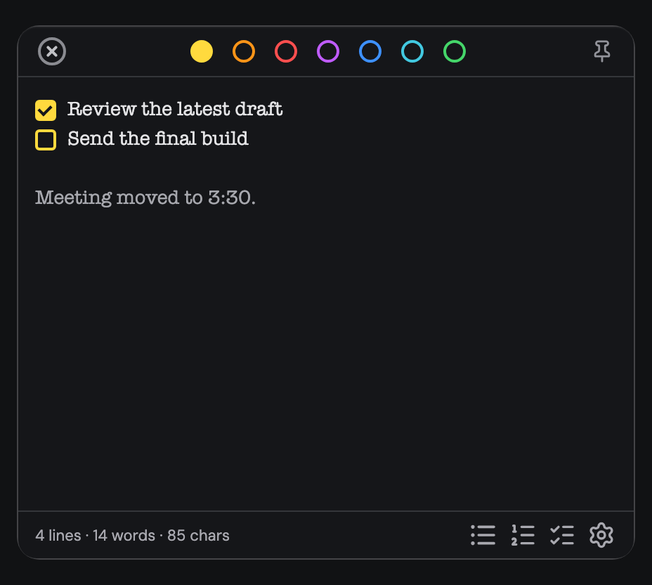

<p align="center">
  
</p>

<h1 align="center">BetterTot</h1>

<p align="center">
  <strong>A fast, local-first scratchpad for the macOS menu bar.</strong>
</p>

<p align="center">
  <a href="https://github.com/saaivignesh20/BetterTot/actions/workflows/ci.yml"></a>
  <a href="./LICENSE"></a>
  
  <a href="https://github.com/saaivignesh20/BetterTot/releases/latest"></a>
</p>

<p align="center">
  
</p>

BetterTot keeps seven lightweight text pads one shortcut away. It is a native
AppKit application with no BetterTot account or analytics.

> [!IMPORTANT]
> BetterTot releases are ad-hoc signed and are not notarized by Apple. macOS
> may require explicit approval in Privacy & Security before first launch.

## Install

Download the ZIP or installer package from the
[latest GitHub release](https://github.com/saaivignesh20/BetterTot/releases/latest),
then verify it with the published SHA-256 checksum. The package installs
BetterTot in `/Applications`; the ZIP can be extracted and moved there
manually.

BetterTot currently has no Apple Developer ID signature: the app is ad-hoc
signed, the installer package is unsigned, and neither is notarized. After you
verify that the downloaded file's SHA-256 value matches the release checksum:

1. Open the `.pkg` and attempt the installation normally.
2. If macOS blocks it, open **System Settings → Privacy & Security**.
3. In **Security**, click **Open Anyway**, authenticate, then confirm **Open**.

Only override the warning for a checksum-verified download from this repository.
Apple documents this one-time exception in
[Open an app by overriding security settings](https://support.apple.com/guide/mac-help/open-an-app-by-overriding-security-settings-mh40617/mac).
Never disable Gatekeeper globally.

## Build from Source

Requires macOS 13 or later and a compatible Xcode toolchain.

```sh
git clone https://github.com/saaivignesh20/BetterTot.git
cd BetterTot
scripts/bundle.sh
scripts/build-and-install.sh
```

`scripts/build-and-install.sh` builds `dist/BetterTot.app`, creates the matching
local `.pkg`, safely replaces `/Applications/BetterTot.app`, and relaunches the
installed copy. Use `scripts/bundle.sh` by itself when you only need an app
bundle and do not want to update the installed application.

## Features

- Seven color-coded scratchpads available from the menu bar
- Custom pad names and colors with immediate panel updates
- Global, configurable keyboard shortcut
- Pinning by dragging, with position restored between launches
- Per-pad undo history, selection, and scroll position
- Footer controls for bulleted, numbered, and checkbox lists
- Optional live line, word, and character statistics
- Native inline checkboxes backed by portable Markdown task-list text
- Live Markdown styling for headings, emphasis, code, and web links
- Optional Apple Writing Tools and Siri support on compatible Macs running macOS 15.1 or later
- Crash recovery through an append-only journal
- Atomic local saves with rolling iCloud Drive backups
- Fixed, app-owned backup location that survives updates and reinstalls
- Plain-text import and export
- Native settings for behavior, pads, editing, storage, and updates
- Daily release checks in bundled builds plus a manual check action
- Versioned ZIP and macOS installer artifacts for tagged builds

## Planned Features

- Additional Markdown syntax highlighting
- Shortcuts app actions
- URL scheme
- Command-line helper
- Optional automatic updater
- Live iCloud synchronization beyond rolling backups
- iOS companion app

## Keyboard Shortcuts

| Shortcut | Action |
|---|---|
| `Option-Command-Space` | Toggle BetterTot |
| `Command-1` ... `Command-7` | Select a pad |
| `Control-Shift-Tab` / `Control-Tab` | Select the previous / next pad |
| `Shift-Command-C` | Copy the entire pad |
| `Shift-Command-Delete` | Clear the pad |
| `Command-P` | Pin or unpin |
| `Command-W` | Close the panel |
| `Command-Return` | Toggle the checkbox on the current line |
| `Escape` | Dismiss an unpinned panel |

Standard macOS editing shortcuts remain available. The pad-switching shortcuts
do not override line-start and line-end navigation in the editor.

## Data and Privacy

BetterTot stores its data in:

```text
~/Library/Application Support/BetterTot/
├── Pads/              # one UTF-8 file per pad
├── Journal/           # crash-recovery snapshots
└── workspace.json     # pad metadata and UI state
```

Backups are stored only in the deterministic iCloud Drive folder
`BetterTot Backups (org.bettertot.BetterTot)`. Local pad and journal data stays
in Application Support, so editing continues without iCloud and normal app
updates or reinstalls do not remove it. Bundled builds check GitHub's public
Releases API at most once per 24 hours; the manual check remains available.
BetterTot never downloads or installs an update automatically. See the complete
[privacy documentation](docs/PRIVACY.md).

## Development

```sh
swift run                  # run from source
scripts/test.sh            # tests and the enforced 80% coverage gate
scripts/bundle.sh          # build an ad-hoc-signed app bundle
scripts/build-and-install.sh # build the app and PKG, then update /Applications
scripts/release.sh         # build and verify the release ZIP, PKG, and checksum
```

The test suite covers persistence, recovery, backups, imports, shortcuts,
settings, update checks, and release tooling. See [SPEC.md](SPEC.md) for the
implemented behavior and architecture, and [PLAN.md](PLAN.md) for project
history and future phases.

## Documentation

- [BetterTot website](https://saaivignesh20.github.io/BetterTot/)
- [Contributing](CONTRIBUTION.md)
- [Security policy](SECURITY.md)
- [Manual testing](docs/MANUAL_TESTING.md)
- [Privacy](docs/PRIVACY.md)
- [Release runbook](docs/RELEASE.md)

## License

Licensed under the [Apache License 2.0](LICENSE). See [NOTICE](NOTICE) for
attribution.
